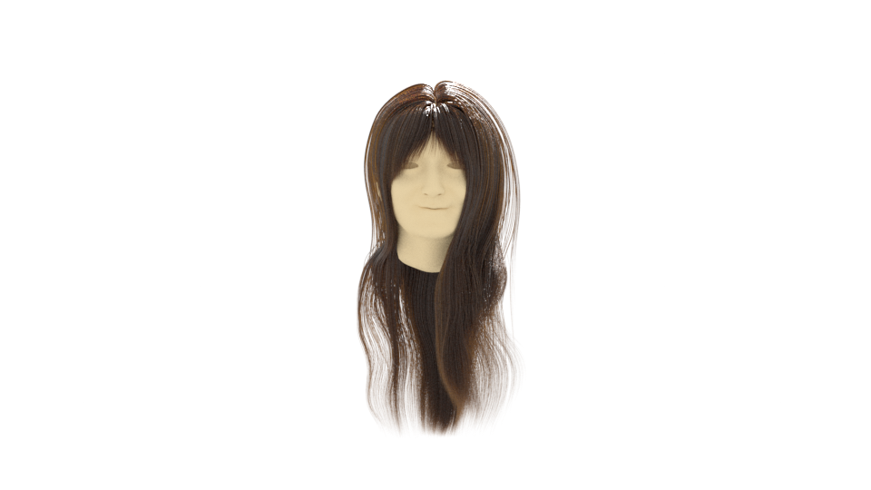

# USC2Mitsuba3

These are tools for rendering USC-HairSalon format hair with mitsuba3.

## Resolve a dependency

```shell
pip install mitsuba
```

## Data preparation

Prealse read [resources/README.md](https://github.com/slimepiki/USC2Mitsuba3/blob/main/resources/README.md).

## Usage

1. Prepare the data according to the above instructions
2. Modify scripts/USC2Mitsuba.py for the source data path
3. Type the below commands
    ```shell
    python3 USC2Mitsuba.py
    python3 render.py
    ```

## Sample



## citation

### Mitsuba3
```
@software{jakob2022mitsuba3,
    title = {Mitsuba 3 renderer},
    author = {Wenzel Jakob and Sébastien Speierer and Nicolas Roussel and Merlin Nimier-David and Delio Vicini and Tizian Zeltner and Baptiste Nicolet and Miguel Crespo and Vincent Leroy and Ziyi Zhang},
    note = {https://mitsuba-renderer.org},
    version = {3.0.1},
    year = 2022,
}
```